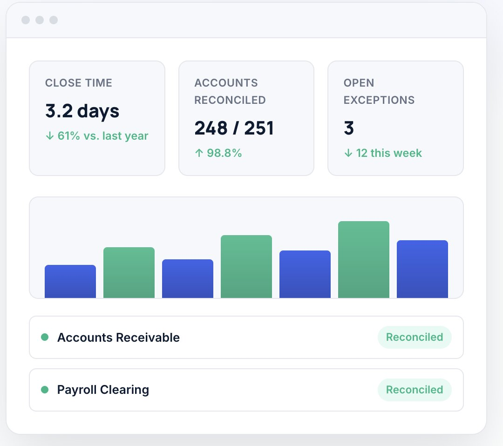

<div align="center">

# 📊 Ledgerline

### Reconciliation and close management for finance teams that report to a board.

[](#-live-metrics)
[](#-live-metrics)
[](#-live-metrics)
[](#-license)

**[🎥 Book a Demo](#)** · **[💰 View Pricing](#)** · **[📚 Docs](#)** · **[📈 Status](#)**

</div>

---

## 🧭 What is Ledgerline?

Closing the books shouldn't take two weeks. **Ledgerline** gives finance teams one dashboard to track close progress, reconcile accounts automatically, and keep an audit trail clean enough that auditors stop asking questions.

Built for teams that answer to a board — not just a spreadsheet.
<p align="center">
  
</p>
<br>

## 📈 Live Metrics

<div align="center">

| ⏱️ Close Time | ✅ Accounts Reconciled | 🚩 Open Exceptions |
|:---:|:---:|:---:|
| **3.2 days** | **248 / 251** | **3** |
| ↓ 61% vs. last year | ↑ 98.8% | ↓ 12 this week |

</div>
```
Accounts Receivable   ● Reconciled
Payroll Clearing      ● Reconciled
```
<p align="center">
  
</p>
<br>

## ✨ Features

<table>
<tr>
<td width="50%">

### 🔄 Automated Reconciliation
Match transactions across every account with minimal manual review.

### 🚨 Exception Queue
Catch mismatches early — not on close day.

### 🏢 Multi-Entity Support
One dashboard, every entity, one close calendar.

</td>
<td width="50%">

### 🔍 Audit-Ready Trail
A history so clean, auditors move faster.

### ⚡ Fast Onboarding
Most teams go live in under two weeks.

### 🔒 Enterprise Security
Financial-grade controls, by default.

</td>
</tr>
</table>

<br>

## 💬 Loved by Finance Leaders

<table>
<tr>
<td width="33%" valign="top">

★★★★★

*"We went from an eleven-day close to under four. The exception queue alone saved our team a full week every month."*

**Elena Marsh**
VP Finance, Northwind

</td>
<td width="33%" valign="top">

★★★★★

*"Our auditors said it was the cleanest trail they'd seen from a mid-market company."*

**Daniel Cho**
Controller, Ashgrove

</td>
<td width="33%" valign="top">

★★★★★

*"Ledgerline paid for itself in the first quarter just from the analyst hours we got back."*

**Priya Nathan**
CFO, Meridian Foods

</td>
</tr>
</table>

<br>

## 🗺️ Site Map

<table>
<tr>
<td valign="top">

**Product**
- Features
- Integrations
- Security
- Pricing

</td>
<td valign="top">

**Company**
- About
- Customers
- Careers
- Contact

</td>
<td valign="top">

**Resources**
- Docs
- Close calendar guide
- Blog
- Status

</td>
<td valign="top">

**Legal**
- Privacy
- Terms
- DPA

</td>
</tr>
</table>

<br>

## 🚀 Getting Started

```bash
# Clone the repo
git clone https://github.com/your-org/ledgerline.git
cd ledgerline

# Install dependencies
npm install

# Run locally
npm run dev
```

<br>

<div align="center">

## Ready to close faster this quarter?

Talk to our team about a rollout plan tailored to your entities and close calendar.

**[Book a Demo](#)** &nbsp;|&nbsp; **[View Pricing](#)**

<br>

<sub>© 2026 Ledgerline, Inc. All rights reserved.</sub>
<br>
<sub>LinkedIn · Twitter · Instagram</sub>

</div>
