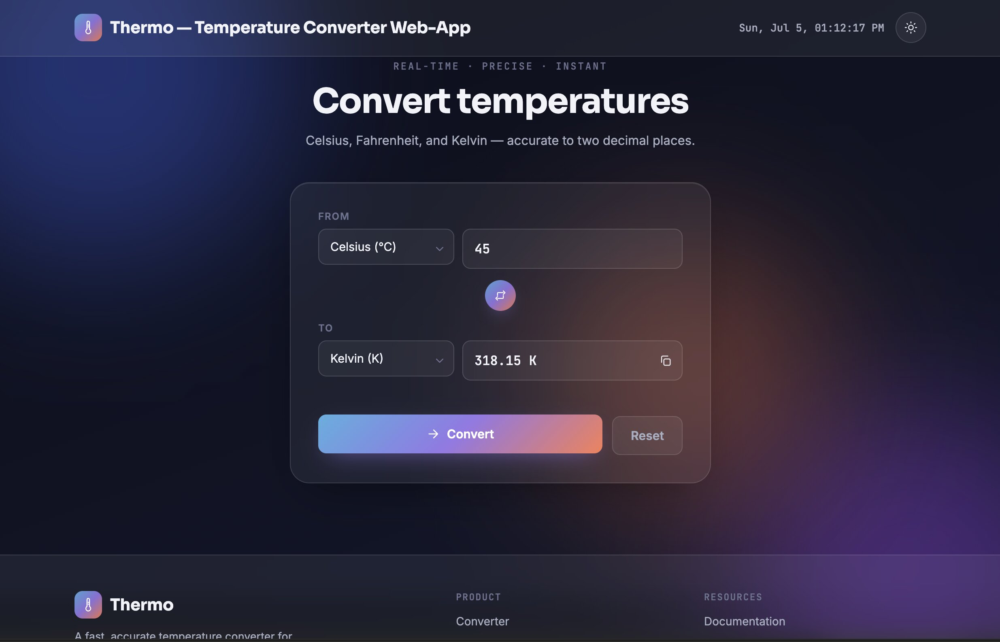

# 🌐 OIBSIP — Web Development Internship (5 july - 15 Aug 2026)

<p align="center">
  
  
  
  
</p>
  Three self-contained front-end projects built for the <b>OIBSIP (Oasis Infobyte)</b> Web Development internship track — Each project demonstrates practical skills in **HTML, CSS, and Vanilla JavaScript**, with a focus on responsive design, clean code, and interactive user experiences. Together, these projects highlight my ability to build modern, user-friendly web applications while following front-end development best practices.
</p>
<b>Task 1.🔗 Live demo:</b></b>(https://yyogendra121.github.io/Portfoliowebsite/) <br>
<b>Task 1.🔗 Live demo:</b>(https://yyogendra121.github.io/Portfoliowebsite/) <br>
<b>Task 1.🔗 Live demo:</b>(https://yyogendra121.github.io/Portfoliowebsite/) <br>

---

## 📁 Project Structure

```
oibsip/
├── Licence
├── README.md
├── task1-landing-page/
│   ├── index.html              → primary submission (Ledgerline — SaaS landing page)
│   └── contact-sheet-co.html   → alternate concept (film-lab brand landing page)
├── task2-portfolio/
│   ├── index.html
│   ├── style.css
│   └── script.js
│   └── images
└── task3-temperature-converter/
    ├── index.html
    ├── style.css
    └── script.js
```

### ▶️ Running any task

Every task can be run the same way — just open its `index.html` in a browser, or serve the folder locally:

```bash
cd task1-landing-page
# or task2-portfolio /
task3-temperature-converter
python3 -m http.server 8000
# visit http://localhost:8000
```

---

## 🧾 Task 1 — Landing Page

**Files:** `task1-landing-page/index.html` (+ `contact-sheet-co.html` as an alternate concept)
**Stack:** HTML5, CSS3 only — no JavaScript

A modern, responsive landing page built with **HTML** and **CSS** for **Ledgerline**, a fictional B2B Finance Operations SaaS platform.
The project focuses on clean UI design, responsive layouts, semantic HTML, and modern CSS techniques without using JavaScript.
**Ledgerline** is a modern, responsive single-page landing website designed for a fictional **B2B Finance Operations SaaS** platform. Built using **HTML** and **CSS** without any JavaScript, the project demonstrates how clean design, semantic markup, and modern CSS techniques can create an engaging and professional marketing experience.
The landing page is structured to guide visitors through a clear conversion-focused journey, beginning with a compelling hero section featuring a bold headline, supporting content, dual call-to-action buttons, and a CSS-only product dashboard mockup. Additional sections highlight the platform's core features, business metrics, customer testimonials, and a strong call-to-action banner, all culminating in a well-organized multi-column footer with essential navigation and contact links.
Overall, this project demonstrates responsive web design, semantic HTML, modern CSS architecture, component-based layouts, and UI/UX best practices while delivering a polished, production-inspired landing page suitable for a contemporary SaaS business.
<p align="center">
  
</p>
**🔗 Live demo:**(https://yyogendra121.github.io/Portfoliowebsite/)
## ✨ Highlights
- Sticky navigation with 4 links, sign-in, and a primary CTA
- Hero: headline, subheadline, dual CTAs, supporting visual
- 4 additional content sections (Features, Stats, Testimonials, CTA banner)
- Footer with contact/social/legal placeholder links
- One consistent color system driven by CSS custom properties (`:root`)
- Responsive via CSS Grid/Flexbox — breakpoints at `980px` and `680px`
- Explicit `box-sizing`, padding, and margin throughout — no overlapping elements
- Two type families (Manrope for display, Inter for body) plus a numeric/mono treatment in the stats band
> `contact-sheet-co.html` is a second, editorial-style take on the same brief (a mail-in film-developing brand) kept for reference/comparison.
## 🚀 Key Features
- Responsive Landing Page
- Sticky Navigation Bar
- Hero Section with CSS-only Dashboard Mockup
- Feature Grid
- Statistics Section
- Testimonials
- Call-to-Action Banner
- Multi-column Footer
- Corporate Color Palette (Navy • Blue • Teal)
- CSS Variables (`:root`) for consistent theming
- CSS Grid & Flexbox Layout
- Mobile Responsive Design
- Clean Semantic HTML5
- No JavaScript

---
## 👨‍💻 Task 2 — Portfolio Website

**Files:** `task2-portfolio/index.html`, `style.css`, `script.js`
**Stack:** HTML5, CSS3, vanilla JavaScript

A modern, fully responsive personal developer portfolio designed to showcase my skills, projects, and professional profile. Built with HTML, CSS, and vanilla JavaScript, the website features a sleek dark theme, interactive UI elements, and a mobile-first responsive design to deliver a smooth user experience across all devices.
**🔗 Live demo:** [yyogendra121.github.io/Portfoliowebsite](https://yyogendra121.github.io/Portfoliowebsite/)

<p align="center">
  
</p>

## ✨ Highlights

- Modern dark-themed UI with a bold accent color palette
- Fully responsive design for desktop, tablet, and mobile devices
- Sticky navigation with a mobile-friendly hamburger menu
- Interactive hero section with a dynamic typing animation
- Clean, well-structured sections for About, Services, Skills, Projects, Teams, and Contact
- Professional project showcase using case-study style cards
- Smooth hover and focus animations for better user experience
- JavaScript-powered interactive components without external frameworks
- Demo contact form with inline success feedback (frontend only)
- Clean, semantic HTML and maintainable CSS architecture

## 🚀 Key Features

- 📌 Sticky navigation bar with responsive mobile menu
- 🎯 Hero section featuring an animated typing effect
- 👨‍💻 About section introducing the developer
- 💼 Services section highlighting offered expertise
- 📂 Project showcase with technology tags and project links
- ⚡ Skills section displaying technical proficiencies
- 👥 Teams section presenting collaborators or team members
- 📬 Contact form with JavaScript-based submission handling
- 🌙 Elegant dark theme with consistent design system
- 📱 Responsive layouts using CSS Grid, Flexbox, and media queries (980px & 680px)
- 🎨 Smooth hover, transition, and focus effects for improved accessibility
- ⚙️ Built entirely with HTML5, CSS3, and Vanilla JavaScript (no frameworks)
- 📈 Optimized structure for performance, readability, and easy future enhancements
- 🔄 Demo contact form prevents page reload and displays an inline success message (frontend only; replace with a real backend endpoint for production)- A demo contact-form submit handler that prevents the default page reload and shows an inline confirmation message (no backend wired up — swap in a real form endpoint to go live)

- A demo contact-form submit handler that prevents the default page reload and shows an inline confirmation message (no backend wired up — swap in a real form endpoint to go live)

Responsive breakpoints at `980px` and `680px`; all interactive elements have visible hover/focus states.

---

## 🌡️ Task 3 — Temperature Converter

**Files:** `task3-temperature-converter/index.html`, `style.css`, `script.js`
**Stack:** HTML, CSS, vanilla JavaScript

A single-card utility app — **Thermo** — that converts a temperature value between **Celsius, Fahrenheit, and Kelvin**, live, as you type.
**Thermo** is a modern, responsive temperature converter web application built with **HTML, CSS, and Vanilla JavaScript**. It provides an intuitive interface for converting temperature values between **Celsius (°C), Fahrenheit (°F), and Kelvin (K)** with instant, real-time updates as the user types. The application eliminates the need for a submit button by performing conversions dynamically through JavaScript event listeners, creating a smooth and interactive user experience.

Designed with a clean single-card layout, the application emphasizes simplicity, readability, and usability while demonstrating core front-end development concepts such as DOM manipulation, event handling, input validation, and responsive web design. The currently selected input unit is visually highlighted, making it easy for users to identify the source measurement at a glance.

To ensure accurate and meaningful results, the converter includes comprehensive validation. Empty inputs automatically clear the output, non-numeric entries display an inline error message, and temperatures below **absolute zero** are rejected with an explanatory warning. For educational purposes, the application also displays the standard temperature conversion formulas, helping users understand the mathematical relationships between the three temperature scales.

The conversion logic follows a reliable two-step approach by first normalizing the input value to **Celsius** and then calculating the equivalent **Fahrenheit** and **Kelvin** values. This structure keeps the code organized, maintainable, and easy to extend with additional units or features in the future.

Overall, this project demonstrates practical JavaScript programming, responsive UI design, semantic HTML, modern CSS styling, and efficient client-side validation while delivering a fast, lightweight, and user-friendly utility application.
**🔗 Live demo:** [yyogendra121.github.io/Portfoliowebsite](https://yyogendra121.github.io/Portfoliowebsite/)
<p align="center">
  
</p>

## ✨ Highlights

- Modern single-card UI with a clean and responsive design
- Real-time temperature conversion as you type
- Supports Celsius, Fahrenheit, and Kelvin units
- Instant updates using JavaScript input and change events
- Visually highlights the selected input unit
- Smart input validation with clear inline error messages
- Rejects temperatures below absolute zero with an explanatory message
- Automatically clears results for empty input
- Displays temperature conversion formulas for quick reference
- Built entirely with HTML5, CSS3, and Vanilla JavaScript (no frameworks)
- 
## 🚀 Key Features

- 🌡️ Convert temperatures between Celsius, Fahrenheit, and Kelvin
- ⚡ Live conversion without requiring a submit button
- 🔄 Updates all three temperature values simultaneously
- 📥 Numeric input with unit selection dropdown
- 🎯 Highlights the active input unit in the results
- ❌ Inline validation for non-numeric input
- 🧊 Prevents values below absolute zero with descriptive feedback
- 📖 Displays standard conversion formulas at the bottom of the application
- 📱 Fully responsive layout for desktop, tablet, and mobile devices
- 🎨 Clean UI with smooth hover and focus effects
- ⚙️ Efficient conversion logic by normalizing all inputs to Celsius before calculating other units
- 🚀 Lightweight, fast, and built using only HTML5, CSS3, and Vanilla JavaScript
Conversion logic (`script.js`) normalizes whatever unit is entered to Celsius first, then derives the other two:

```js
F = C × 9/5 + 32
K = C + 273.15
C = (F − 32) × 5/9
```

---

## 🛠️ Tech Stack

| Task | HTML | CSS | JavaScript |
|------|:----:|:---:|:----------:|
| 1 — Landing Page | ✅ | ✅ | — |
| 2 — Portfolio | ✅ | ✅ | ✅ |
| 3 — Temperature Converter | ✅ | ✅ | ✅ |

---

## 📝 Notes for Reviewers

- All three tasks are static front-end deliverables; Task 2 and Task 3 use small amounts of vanilla JS for interactivity, Task 1 intentionally uses none.
- No external dependencies beyond Google Fonts (`<link>` tags in each `<head>`) — everything else (icons, mockups, layout) is hand-written HTML/CSS/JS.
- Each task folder is independent and can be zipped/deployed separately (e.g. to GitHub Pages, Netlify, or Vercel) without pulling in the other two.

---
<p align="center">
  Made with ❤️ during the <b>Oasis Infobyte Web Development Internship</b>
</p>
